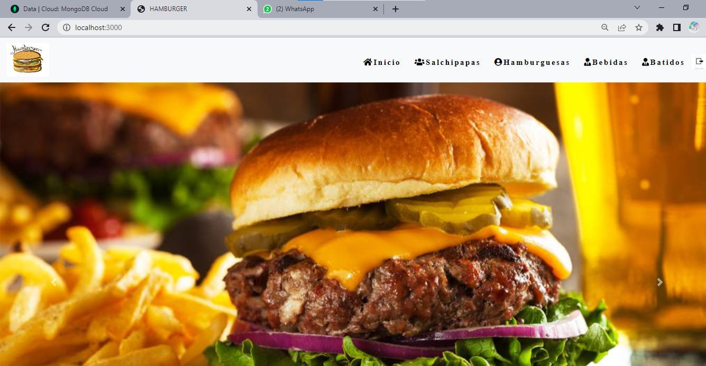
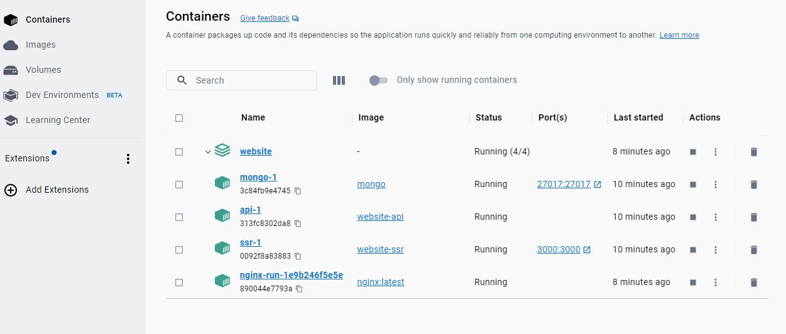
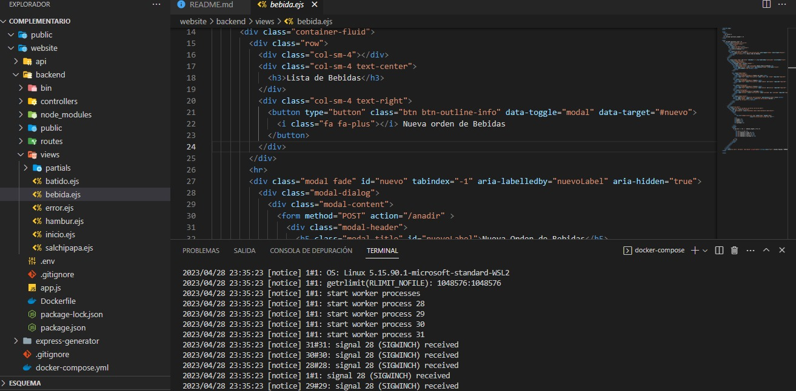
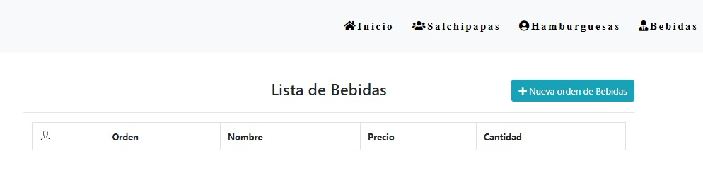
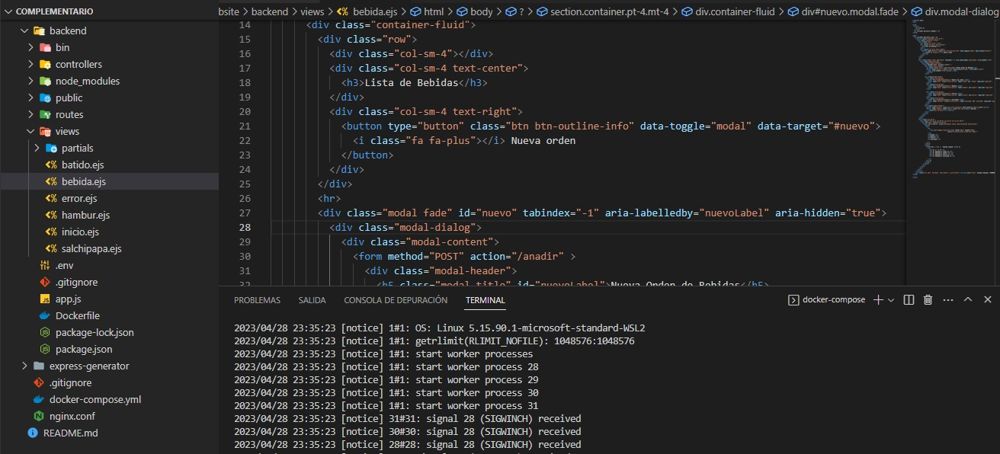
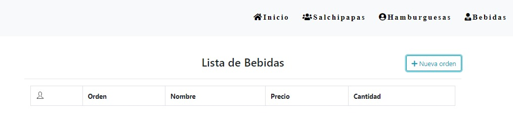
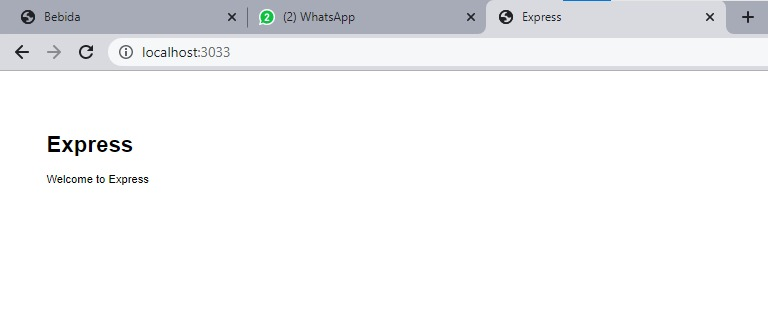
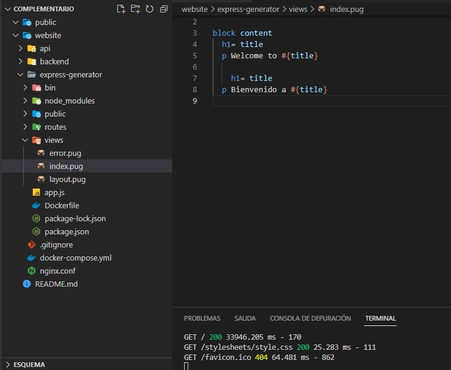
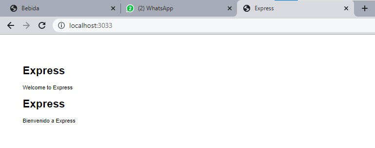

1. MONTAR APLICACION DESARROLLADA EN SEMESTRES ANTERIORES QUE UTILICE UNA TECNOLOGIA O UN FRAMEWORK ACTUAL

2. DOCKERIZAR TODOS LOS COMPONENTES DE LA APLICACION PARA UN ENTORNO DE DESARROLLO 

3. UTILIZAR POR LO MENOS 5 FUNCIONALIDADES DE LAS HERRAMIENTAS, FRAMEWORKS O CLI APLICANDO EL ACCESO A LOS DOCKERS DE FORMA INTERACTIVA

         docker-compose run --rm express init --y
[Docker funcional](public/41.jpeg)

        docker-compose run --rm express install express-generator
[Docker funcional](public/42.jpeg)

        añadir comando al package.json -> "create": "express --view=pug ."
[Docker funcional](public/43.jpeg)

        docker-compose run --rm express run create
[Docker funcional](public/44.jpeg)

        docker-compose run --rm express install
[Docker funcional](public/45.jpeg)

        docker-compose run -p 3033:3033 --rm express run start DEBUG=app:*

                    Pagina ejecutada en "localhost:3033"

4. CARGAR APLICACION FUNIONANDO Y PERMITIR REALIZAR CAMBIOS DESDE EL HOST 

5. EVIDENCIAR LA FUNCIONALIDAD DE LO DESARROLLADO EN UN ARCHIVO MD SOBRE GIT

