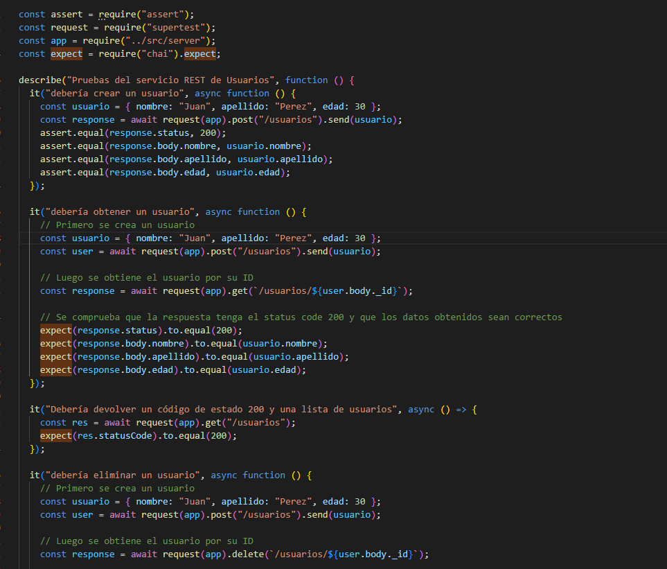
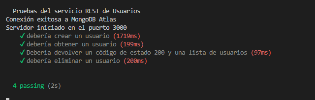
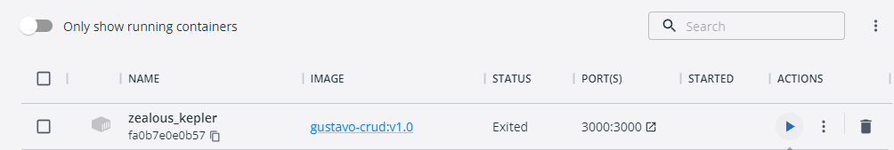
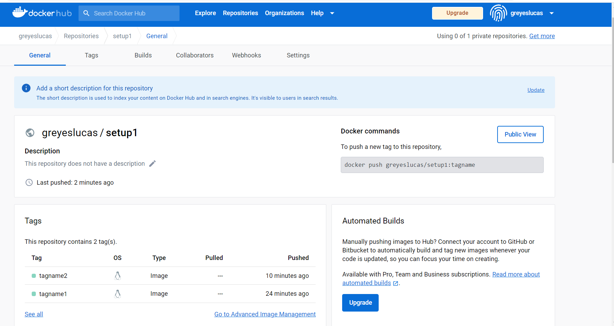

## Dockerizando una aplicación Node.js

En este proyecto hemos dockerizado una aplicación Node.js, junto con sus pruebas, y subido ambas imágenes a Docker Hub como versiones de la misma imagen.

### 1. Configurar el entorno de desarrollo

Primero, configuramos nuestro entorno de desarrollo con Node.js y Docker. Para esto, instalamos Node.js y Docker Desktop.

### 2. Crear una aplicación Node.js

A continuación, creamos una aplicación Node.js utilizando Express y MongoDB. La aplicación implementa un servicio RESTful básico que permite realizar operaciones CRUD sobre una colección de usuarios en una base de datos MongoDB.

### 3. Escribir pruebas unitarias

Después, escribimos pruebas unitarias para nuestra aplicación utilizando Mocha, Chai y Supertest. Las pruebas comprueban el funcionamiento correcto de los diferentes endpoints del servicio REST.



### 4. Crear un archivo Dockerfile

Luego, creamos un archivo Dockerfile para construir una imagen Docker de nuestra aplicación. El archivo Dockerfile consta de tres etapas:

#### Etapa 1: Construir el código fuente

En esta etapa, utilizamos una imagen de Node.js para construir nuestro código fuente. Copiamos el archivo package.json y ejecutamos el comando npm install para instalar las dependencias de nuestro proyecto. Luego, copiamos el resto de los archivos del proyecto y ejecutamos el comando npm run build para compilar el código fuente.

#### Etapa 2: Ejecutar pruebas

En esta etapa, utilizamos la misma imagen que en la etapa anterior para ejecutar nuestras pruebas unitarias. Configuramos la variable de entorno NODE_ENV para que tenga el valor "test", e instalamos las dependencias de desarrollo. Finalmente, ejecutamos el comando npm run test para correr nuestras pruebas.



#### Etapa 3: Desplegar la aplicación en un servidor Node.js

En esta etapa, utilizamos una imagen más liviana de Node.js (alpine) para desplegar nuestra aplicación en un servidor Node.js. Copiamos el archivo package.json, instalamos sólo las dependencias necesarias para ejecutar nuestra aplicación y copiamos los archivos compilados en la etapa anterior (/dist) a la imagen.

### 5. Construir y probar la imagen Docker

Una vez que tenemos nuestro archivo Dockerfile, construimos la imagen Docker utilizando el comando docker build. Luego, probamos la imagen corriendo un contenedor Docker utilizando el comando docker run. Verificamos que nuestra aplicación esté corriendo correctamente y que nuestras pruebas hayan pasado exitosamente.



### 6. Subir la imagen a Docker Hub

Finalmente, subimos nuestra imagen a Docker Hub utilizando los comandos docker tag y docker push. Creamos dos tags diferentes para nuestra imagen: una para la aplicación y otra para las pruebas. Ambas imágenes se suben como versiones de la misma imagen.



### 7. Descargar imagen y probar en local

Para descargar la imagen de Docker Hub y probarla en local, sigue los siguientes pasos:

Abre una terminal en tu computadora y ejecuta el siguiente comando para descargar la imagen del servicio REST:

```
docker pull <tu_usuario>/docker-gustavo:rest
```

Una vez descargada la imagen, ejecuta el siguiente comando para iniciar un contenedor a partir de la imagen:

```
docker run -p 3000:3000 --name rest <tu_usuario>/docker-gustavo:rest
```

Este comando inicia un contenedor con el nombre "rest" y expone el puerto 3000 del contenedor en el puerto 3000 de tu máquina local.

Abre un navegador web y accede a la siguiente URL para verificar que el servicio REST está funcionando correctamente:

```
http://localhost:3000/
```

Si todo funciona correctamente, deberías ver un mensaje de bienvenida.

Para detener el contenedor, ejecuta el siguiente comando en otra terminal:

```
docker stop rest
```
