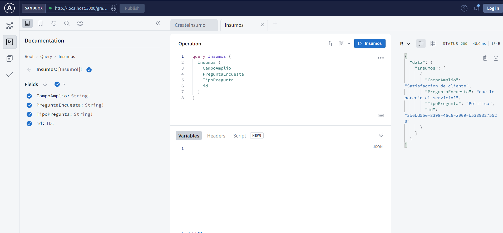
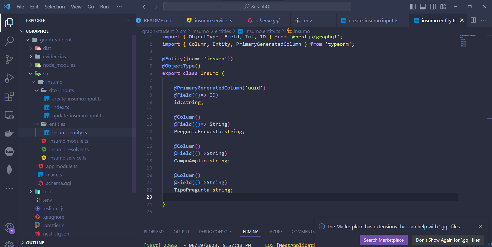
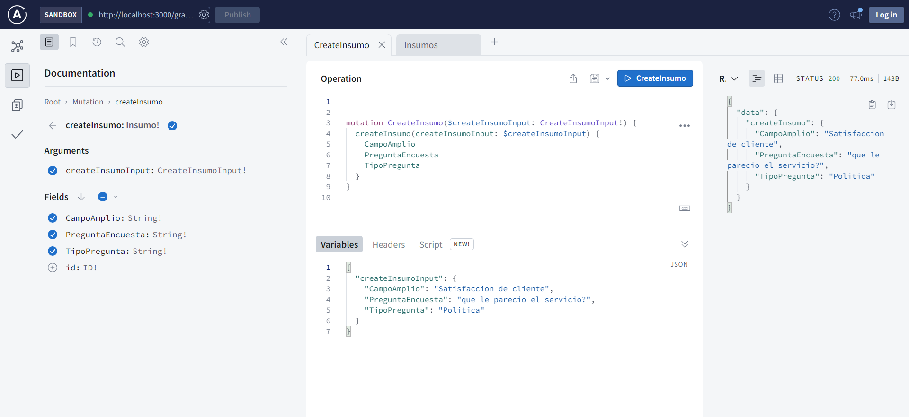
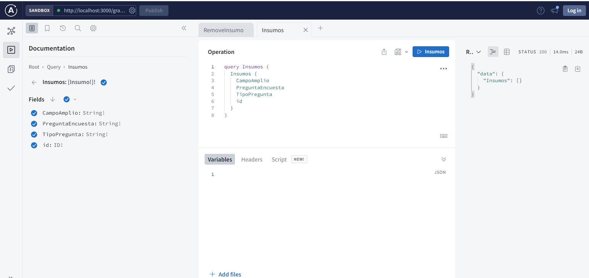
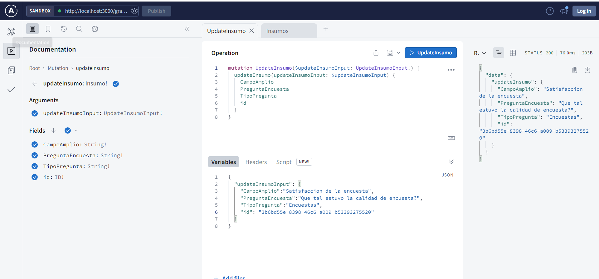
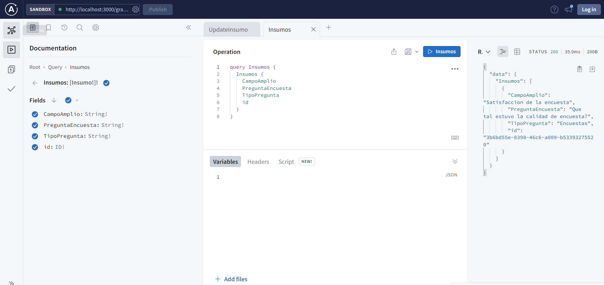

## INSUMOS DE ENCUESTA

## INSUMOS DE ENCUESTA

## INSUMOS DE ENCUESTA

## INSUMOS DE ENCUESTA

## INSUMOS DE ENCUESTA

## INSUMOS DE ENCUESTA

## INSUMOS DE ENCUESTA

## INSUMOS DE ENCUESTA

## INSUMOS DE ENCUESTA

  
