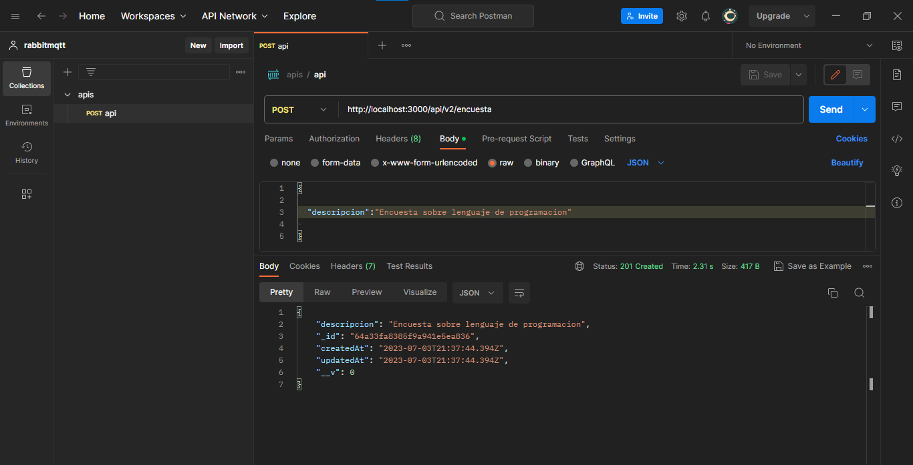
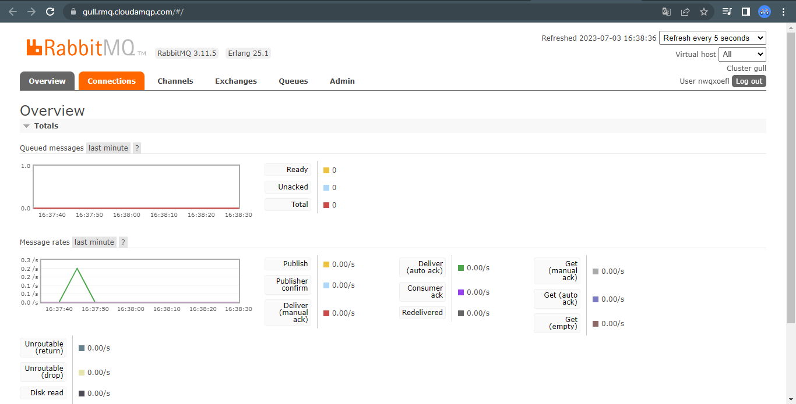
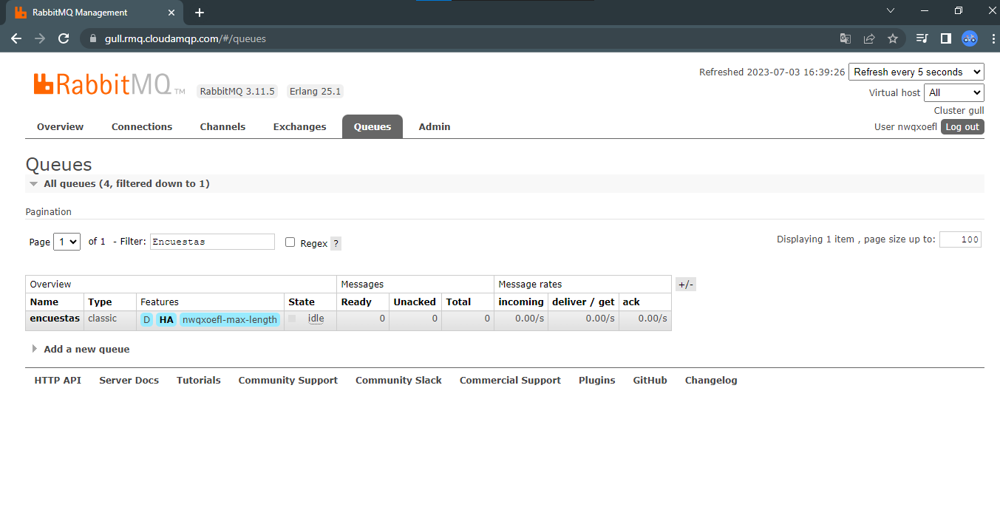
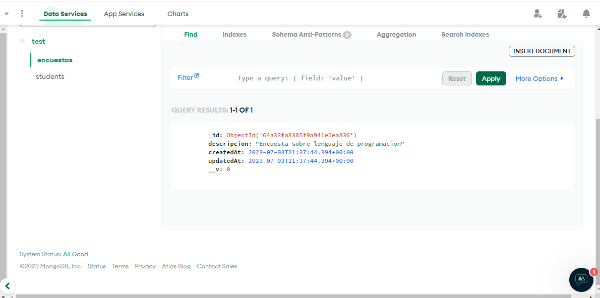
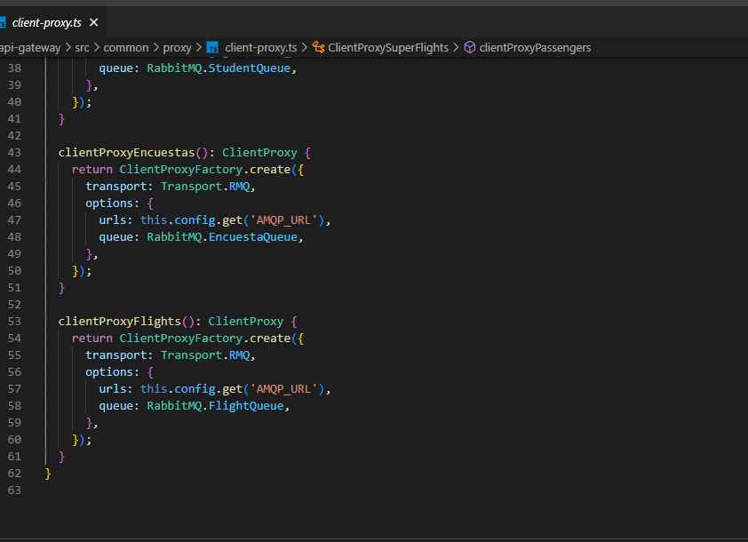
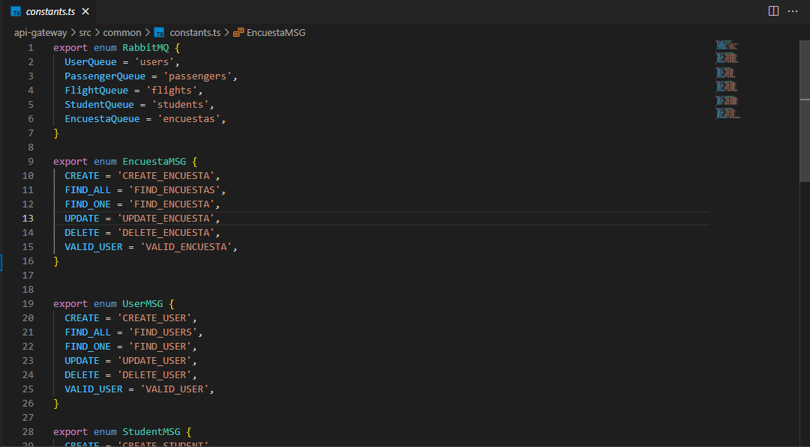

# PRÁCTICA 4

### RABBITMQ MANAGER

Se definio el microservicio-encuestas

## EVIDENCIA DEL POSTMAN AL VALIDAR LA API/V2/ENCUESTA

### Guardando datos

## Evidencia en CloudAMQP al registrar datos, aumenta el gráfico

### Muestra la colas de encuesta en CloudAMQP

### Mostrando en la base de datos mongo atlas el dato insertado 

### Captures de código fuente

